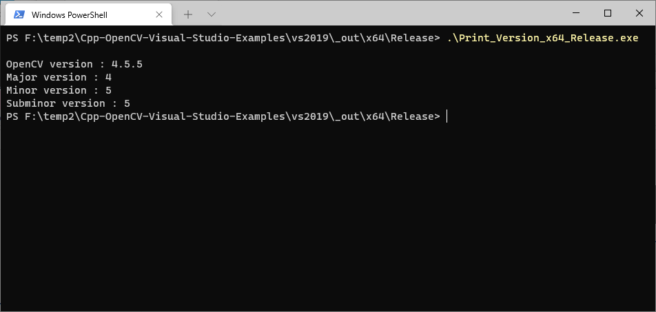
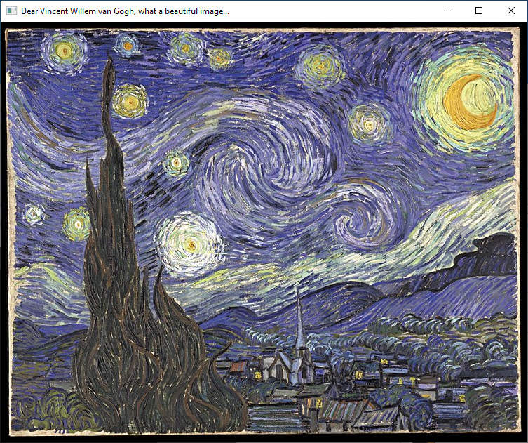

# Examples

## Print OpenCV Version

```sh
.
├─ vs2015/
│  ├─ 1_Print_Version/*
├─ vs2017/
│  ├─ 1_Print_Version/* 
├─ vs2019/
│  ├─ 1_Print_Version/*
├─ vs2022/
│  ├─ 1_Print_Version/*
```



## Image Read and Display

```sh
.
├─ vs2015/
│  ├─ 2_Image_Read_and_Display/*
├─ vs2017/
│  ├─ 2_Image_Read_and_Display/* 
├─ vs2019/
│  ├─ 2_Image_Read_and_Display/*
├─ vs2022/
│  ├─ 2_Image_Read_and_Display/*
```



## Webcam Read and Display

```sh
.
├─ vs2015/
│  ├─ 3_Image_Webcam_Read_and_Display/*
├─ vs2017/
│  ├─ 3_Image_Webcam_Read_and_Display/*
├─ vs2019/
│  ├─ 4_Image_Webcam_Canny_Detection/* 
├─ vs2022/
│  ├─ 3_Image_Webcam_Read_and_Display/*
```


## Webcam Canny Edge Detection

```sh
.
├─ vs2015/
│  ├─ 4_Image_Webcam_Canny_Detection/*
├─ vs2017/
│  ├─ 4_Image_Webcam_Canny_Detection/* 
├─ vs2019/
│  ├─ 4_Image_Webcam_Canny_Detection/*
├─ vs2022/
│  ├─ 4_Image_Webcam_Canny_Detection/*
```


## Image Traffic Sign Detection

```sh
.
├─ vs2015/
│  ├─ 5_Image_Traffic_Sign_Detection/*
├─ vs2017/
│  ├─ 5_Image_Traffic_Sign_Detection/* 
├─ vs2019/
│  ├─ 4_Image_Webcam_Canny_Detection/*
├─ vs2022/
│  ├─ 5_Image_Traffic_Sign_Detection/*
```

