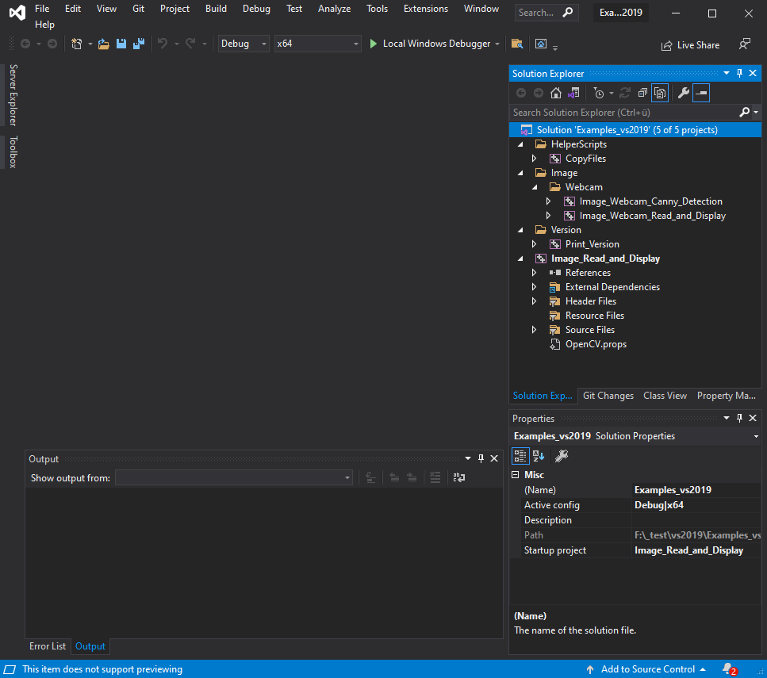
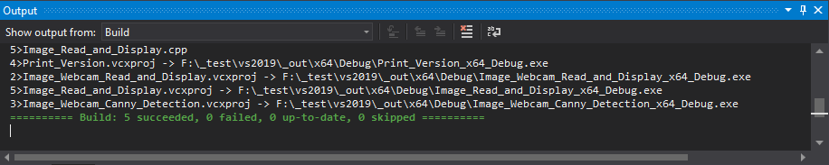

# Getting started

## Download

- Navigate to the [repository](https://github.com/thommyho/Cpp-OpenCV-Windows-PreBuilts)
- On the landing page select your desired OpenCV version

Or use following release table

|                                                                Version                                                                |                                    Build-Info                                    |        All Build-Configurations         |                Examples                 |
|:-------------------------------------------------------------------------------------------------------------------------------------:|:--------------------------------------------------------------------------------:|:---------------------------------------:|:---------------------------------------:|
| **[4.7.0](https://github.com/thommyho/Cpp-OpenCV-Windows-PreBuilts/releases/tag/v4.7.0) (:octicons-heart-fill-24:{ .heart } latest)** | **[link](https://github.com/thommyho/Cpp-OpenCV-Windows-PreBuilts/tree/v4.7.0)** | :material-check-decagram:{ .tick-blue } | :material-check-decagram:{ .tick-blue } |
|                         [4.5.5](ttps://github.com/thommyho/Cpp-OpenCV-Windows-PreBuilts/releases/tag/v4.6.0)                          |   [link](https://github.com/thommyho/Cpp-OpenCV-Windows-PreBuilts/tree/v4.6.0)   | :material-check-decagram:{ .tick-blue } | :material-check-decagram:{ .tick-blue } |
|                         [4.5.5](ttps://github.com/thommyho/Cpp-OpenCV-Windows-PreBuilts/releases/tag/v4.5.5)                          |   [link](https://github.com/thommyho/Cpp-OpenCV-Windows-PreBuilts/tree/v4.5.5)   | :material-check-decagram:{ .tick-blue } | :material-check-decagram:{ .tick-blue } |
|                         [4.5.4](ttps://github.com/thommyho/Cpp-OpenCV-Windows-PreBuilts/releases/tag/v4.5.4)                          |   [link](https://github.com/thommyho/Cpp-OpenCV-Windows-PreBuilts/tree/v4.5.4)   | :material-check-decagram:{ .tick-blue } | :material-check-decagram:{ .tick-blue } |

The precompiled libraries are attached as assets compressed in zip archives to the bottom of the page.
!!! warning "Please check the Build-Info for the included OpenCV modules"

!!! success

    - [x] Downloaded one or more archives e.g.: `MSVC142_64.zip`.
    - [x] Downloaded the corresponding `Examples.zip` of the release.

## Unpack the archives

If you completed the task, proceed as follows to this project setup

```sh
.
├─ vs2015/      # -> From Examples.zip - Directory containing project files (organize source code files and other resources) for Visual Studio 2015
├─ vs2017/      # -> From Examples.zip - Directory containing project files (organize source code files and other resources) for Visual Studio 2017
├─ vs2019/      # -> From Examples.zip - Directory containing project files (organize source code files and other resources) for Visual Studio 2019
├─ vs2022/      # -> From Examples.zip - Directory containing project files (organize source code files and other resources) for Visual Studio 2022
├─ MSVC140_32/  # -> From MSC140_32.zip - Directory containing the prebuilt libraries and header files for Visual Studio 2015 targeting 32-bit
├─ MSVC140_64/  # -> From MSC140_64.zip - Directory containing the prebuilt libraries and header files for Visual Studio 2015 targeting 64-bit
├─ MSVC140_32/  # -> From MSC141_32.zip - Directory containing the prebuilt libraries and header files for Visual Studio 2017 targeting 32-bit
├─ MSVC140_64/  # -> From MSC141_64.zip - Directory containing the prebuilt libraries and header files for Visual Studio 2017 targeting 64-bit
├─ MSVC142_32/  # -> From MSC142_32.zip - Directory containing the prebuilt libraries and header files for Visual Studio 2019 targeting 64-bit
├─ MSVC142_64/  # -> From MSC142_64.zip - Directory containing the prebuilt libraries and header files for Visual Studio 2019 targeting 64-bit
├─ MSVC143_32/  # -> From MSC143_32.zip - Directory containing the prebuilt libraries and header files for Visual Studio 2022 targeting 32-bit
├─ MSVC143_64/  # -> From MSC143_64.zip - Directory containing the prebuilt libraries and header files for Visual Studio 2022 targeting 64-bit
├─ .gitattributes  # Can be ignored.
├─ .gitignore      # Can be ignored.
└─ README.md       # Can be ingored.
```

## Build Examples

### The project setup

Place for holding the Visual Studio Examples source code is following git [repository](https://github.com/thommyho/Cpp-OpenCV-Visual-Studio-Examples)

In every directory there is solution file with `Examples_<vs_compiler_name>.sln` and other directories holding the wanted examples, required project, configuration and resource files. For e.g. vs2019 the directory-file-tree looks like that

```sh
.
├─ vs2019/
│  ├─ 0_HelperScripts/*                  # Contains required helper projects e.g. copying files
│  ├─ 1_Print_Version/*                  # Contains project files and source code for this example
│  ├─ 2_Image_Read_and_Display/*         # ~
│  ├─ 3_Image_Webcam_Read_and_Display/*  # ~
│  ├─ 4_Image_Webcam_Canny_Detection/*   # ~
│  ├─ OpenCV_PropertySheet/*             # Contains the property sheet for easy including the required compile and linking dependencies
│  ├─ res/*                              # Contains required files for specific examples.
│  └─ Examples_vs2019.sln                # The solution file including and organizing all the example projects
```

### Using Visual Studio IDE :material-microsoft-visual-studio:

!!! warning " Please make sure that you have the correct/any :material-language-cpp: build tools installed. "

Open the `Examples_<vs_compiler_name>.sln` with the required IDE version.
If everything was correctly placed (unpacked), no error popup will appear :stuck_out_tongue_winking_eye:.

!!! help " For further help checkout the FAQ or create an issue. "

And it will look this snapshot using VS 2019 IDE.


Click :material-cursor-default-click: `Examples_<vs_compiler_name>` and choose `Build Solution` or simply use the shortcut ++ctrl+shift+b++ to build all examples.

!!! success

    

!!! info " Output Directory "

    The output layout follows this scheme
    ```sh
    .
    └─ _out_/
       └─ <architecture>/              # x64 or x86
          └─ <build configuration>/    # Debug, Release or RelWithDebInfo
             └─ <All the examples>/*   # binares and ressources
    ```
